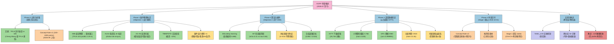

```mermaid
graph TD
    nroot["KGFP 申请推进<br/>(2026-07 至今)"]
    np0["Phase 0 立项与初版<br/>(研究方向定位)"]
    np0_lit["文献：TFLN 流片速度 vs SiN<br/>(Cheng Wang 组 TFLN 更快)"]
    np0_v1["Concept Note v1 (100–1000 ps/nm)<br/>(2026-09 上旬)"]
    np1["Phase 1 器件物理标定<br/>(Objective 1 设计规则)"]
    np1_m3b["M3b 延迟预算 → 亚米窗口<br/>(TFLN 424 ps/dB; 0.19 m)"]
    np1_a1a2["A1/A2 条宽与 dn 标定<br/>(dλ/dw=46 nm/µm)"]
    np1_a3a6["A3–A6 容差扫描<br/>(相位/温度/切趾/长度)"]
    np1_cross["TMM/FDTD 交叉校验<br/>(偏差 ~10%)"]
    np1_rules["器件设计规则 ×4<br/>(摆幅/切趾/条宽/dn/温漂)"]
    np2["Phase 2 算法与编码<br/>(Objective 2 光子 SNN)"]
    np2_m3a["M3a delay learning<br/>(连续编码 0.888)"]
    np2_m7["M7 信息量匹配<br/>(echo 0.41 vs raw 0.66)"]
    np2_quant["池权重量化免疫<br/>(4–8 bit 不降性能)"]
    np2_synth["合成道路目标<br/>(0.892 / 0.919)"]
    np3["Phase 3 真实数据验证<br/>(从合成到 KITTI)"]
    np3_download["KITTI 下载/提取<br/>(28,746 对象)"]
    np3_small["小预算扫描链 0.766<br/>(train=1200)"]
    np3_gpu["GPU 移植 3060<br/>(corr=0.999991)"]
    np3_full["全量预算 0.923<br/>(train=21.5k)"]
    np3_gain["扫描链增益谱系<br/>(受限场景价值)"]
    np4["Phase 4 申请交付<br/>(Stage 1 截止 2026-10-01)"]
    np4_v2["Concept Note v2<br/>(带宽绑定规格+风险句)"]
    np4_rec["推荐信素材<br/>(口径与红线)"]
    np4_stage1["Stage 1 提交 (todo)<br/>(CN+CV+两封推荐信)"]
    npx["支撑与教训<br/>(跨会话/跨机器)"]
    npx_tasklog["TASK_LOG 交接机制<br/>(事实源)"]
    npx_git["两仓库 Git 迁移<br/>(代码+数据通道)"]
    npx_sleep["教训：12h 睡眠假象<br/>(先 profile 再优化)"]
    nroot --> np0
    np0 --> np0_lit
    np0 --> np0_v1
    nroot --> np1
    np1 --> np1_m3b
    np1 --> np1_a1a2
    np1 --> np1_a3a6
    np1 --> np1_cross
    np1 --> np1_rules
    nroot --> np2
    np2 --> np2_m3a
    np2 --> np2_m7
    np2 --> np2_quant
    np2 --> np2_synth
    nroot --> np3
    np3 --> np3_download
    np3 --> np3_small
    np3 --> np3_gpu
    np3 --> np3_full
    np3 --> np3_gain
    nroot --> np4
    np4 --> np4_v2
    np4 --> np4_rec
    np4 --> np4_stage1
    nroot --> npx
    npx --> npx_tasklog
    npx --> npx_git
    npx --> npx_sleep
    classDef root fill:#f7b6d3,stroke:#555555,color:#222222;
    classDef phase fill:#9ecae1,stroke:#555555,color:#222222;
    classDef milestone fill:#a1d99b,stroke:#555555,color:#222222;
    classDef knowledge fill:#ffe08a,stroke:#555555,color:#222222;
    classDef deliverable fill:#fdd0a2,stroke:#555555,color:#222222;
    classDef infra fill:#c7c7f0,stroke:#555555,color:#222222;
    classDef lesson fill:#e88a8a,stroke:#555555,color:#222222;
    class nroot root;
    class np0 phase;
    class np0_lit milestone;
    class np0_v1 deliverable;
    class np1 phase;
    class np1_m3b milestone;
    class np1_a1a2 milestone;
    class np1_a3a6 milestone;
    class np1_cross milestone;
    class np1_rules knowledge;
    class np2 phase;
    class np2_m3a milestone;
    class np2_m7 milestone;
    class np2_quant knowledge;
    class np2_synth milestone;
    class np3 phase;
    class np3_download milestone;
    class np3_small milestone;
    class np3_gpu milestone;
    class np3_full knowledge;
    class np3_gain knowledge;
    class np4 phase;
    class np4_v2 deliverable;
    class np4_rec deliverable;
    class np4_stage1 deliverable;
    class npx phase;
    class npx_tasklog infra;
    class npx_git infra;
    class npx_sleep lesson;
```
