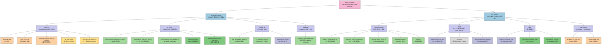

```mermaid
graph TD
    nworkspace["KGFP 工作空间<br/>(tfln-dispersion-lab + lidar-pointnet)"]
    ntfln["tfln-dispersion-lab<br/>(TFLN 色散/器件/光子链路)"]
    ntfln_docs["申请文书<br/>(Concept Note / 报告 / 日志)"]
    ntfln_readme["README.md<br/>(项目总览)"]
    ntfln_tasklog["TASK_LOG.md<br/>(会话交接事实源)"]
    ntfln_report["simulation_report_2026-09-20.docx<br/>(器件仿真报告)"]
    ntfln_labnote["lab-note.ipynb<br/>(实验记录主笔记)"]
    ntfln_ms["milestone-M1~M4.ipynb<br/>(4 个里程碑 notebook)"]
    ntfln_dev["器件仿真<br/>(TMM/FDTD + 容差扫描)"]
    ntfln_sim["simulations/02_tolerance_scan.py<br/>(TMM 容差扫描)"]
    ntfln_fdtd["lumerical/run_tolerance_fdtd.py<br/>(FDTD 均匀/啁啾光栅)"]
    ntfln_m3b["lumerical/m3b_delay_budget.py<br/>(延迟预算 424 ps/dB)"]
    ntfln_fdtd_res["lumerical/results/<br/>(FDTD 原始数据)"]
    ntfln_tol_res["results/tolerance_scan.{npz,png}<br/>(容差扫描结果)"]
    ntfln_kg["知识/图谱<br/>(任务-知识网络)"]
    ntfln_kg_py["task_knowledge_graph.py<br/>(图谱生成脚本)"]
    ntfln_cards["kg_obsidian_cards.py<br/>(Obsidian 卡片生成)"]
    ntfln_kg_json["results/task_kg.json<br/>(43 节点 48 边)"]
    ntfln_infra["基础设施<br/>(Notebook 构建 + Git)"]
    ntfln_build["build_m1~m4_notebook.py<br/>(自动生成 milestone notebook)"]
    nlidar["lidar-pointnet<br/>(光子 SNN / LiDAR 分类实验)"]
    nlidar_code["LiDAR/SNN 代码<br/>(训练、编码、读出)"]
    nlidar_m7["snn/m7_matched_info.py<br/>(M7 信息量匹配)"]
    nlidar_kitti["snn/road_kitti_experiment.py<br/>(KITTI 扫描链分类)"]
    nlidar_isal["snn/isal_range_profile.py<br/>(ISAL 距离像生成)"]
    nlidar_pn["models/pointnet.py<br/>(PointNet 基线)"]
    nlidar_train["train.py<br/>(端到端训练)"]
    nlidar_data["数据<br/>(KITTI / ModelNet40 / road_objects)"]
    nlidar_road["data/road_objects.npz<br/>(28,746 道路对象)"]
    nlidar_kitti_dir["data/kitti/<br/>(原始 Velodyne + label)"]
    nlidar_mn40["data/modelnet40_*.parquet<br/>(ModelNet40 基准)"]
    nlidar_res["结果<br/>(实验输出)"]
    nlidar_m7_res["outputs_m7/results.json<br/>(M7 echo/raw 对比)"]
    nlidar_kitti_res["snn/outputs_isal/road_kitti/<br/>(KITTI 0.923)"]
    nlidar_outputs["snn/outputs_classify/<br/>(ModelNet40 分类)"]
    nlidar_docs["文档/运行书<br/>(README + RUNBOOK)"]
    nlidar_runbook["RUNBOOK_3060.md<br/>(3060 开箱指南)"]
    nlidar_readme["snn/README.md<br/>(SNN 实验说明)"]
    nworkspace --> ntfln
    ntfln --> ntfln_docs
    ntfln_docs --> ntfln_readme
    ntfln_docs --> ntfln_tasklog
    ntfln_docs --> ntfln_report
    ntfln_docs --> ntfln_labnote
    ntfln_docs --> ntfln_ms
    ntfln --> ntfln_dev
    ntfln_dev --> ntfln_sim
    ntfln_dev --> ntfln_fdtd
    ntfln_dev --> ntfln_m3b
    ntfln_dev --> ntfln_fdtd_res
    ntfln_dev --> ntfln_tol_res
    ntfln --> ntfln_kg
    ntfln_kg --> ntfln_kg_py
    ntfln_kg --> ntfln_cards
    ntfln_kg --> ntfln_kg_json
    ntfln --> ntfln_infra
    ntfln_infra --> ntfln_build
    nworkspace --> nlidar
    nlidar --> nlidar_code
    nlidar_code --> nlidar_m7
    nlidar_code --> nlidar_kitti
    nlidar_code --> nlidar_isal
    nlidar_code --> nlidar_pn
    nlidar_code --> nlidar_train
    nlidar --> nlidar_data
    nlidar_data --> nlidar_road
    nlidar_data --> nlidar_kitti_dir
    nlidar_data --> nlidar_mn40
    nlidar --> nlidar_res
    nlidar_res --> nlidar_m7_res
    nlidar_res --> nlidar_kitti_res
    nlidar_res --> nlidar_outputs
    nlidar --> nlidar_docs
    nlidar_docs --> nlidar_runbook
    nlidar_docs --> nlidar_readme
    classDef root fill:#f7b6d3,stroke:#555555,color:#222222;
    classDef repo fill:#9ecae1,stroke:#555555,color:#222222;
    classDef category fill:#c7c7f0,stroke:#555555,color:#222222;
    classDef doc fill:#fdd0a2,stroke:#555555,color:#222222;
    classDef notebook fill:#ffe08a,stroke:#555555,color:#222222;
    classDef code fill:#a1d99b,stroke:#555555,color:#222222;
    classDef data fill:#d9d9d9,stroke:#555555,color:#222222;
    classDef datafile fill:#bcbddc,stroke:#555555,color:#222222;
    classDef results fill:#7ec97e,stroke:#555555,color:#222222;
    classDef infra fill:#e8b4d8,stroke:#555555,color:#222222;
    class nworkspace root;
    class ntfln repo;
    class ntfln_docs category;
    class ntfln_readme doc;
    class ntfln_tasklog doc;
    class ntfln_report doc;
    class ntfln_labnote notebook;
    class ntfln_ms notebook;
    class ntfln_dev category;
    class ntfln_sim code;
    class ntfln_fdtd code;
    class ntfln_m3b code;
    class ntfln_fdtd_res results;
    class ntfln_tol_res results;
    class ntfln_kg category;
    class ntfln_kg_py code;
    class ntfln_cards code;
    class ntfln_kg_json datafile;
    class ntfln_infra category;
    class ntfln_build code;
    class nlidar repo;
    class nlidar_code category;
    class nlidar_m7 code;
    class nlidar_kitti code;
    class nlidar_isal code;
    class nlidar_pn code;
    class nlidar_train code;
    class nlidar_data category;
    class nlidar_road datafile;
    class nlidar_kitti_dir data;
    class nlidar_mn40 datafile;
    class nlidar_res category;
    class nlidar_m7_res datafile;
    class nlidar_kitti_res results;
    class nlidar_outputs results;
    class nlidar_docs category;
    class nlidar_runbook doc;
    class nlidar_readme doc;
```
